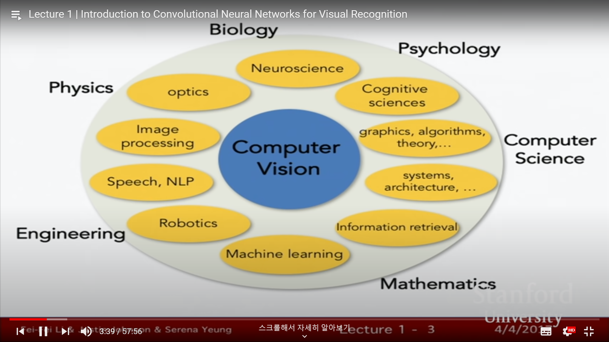

computer vision. about visual data. 

importance 

exploded ridiculously. smartphones. censors. massive amt of visual data. 2017 80pct of the intertnet traffic video. critical to develop algo to understand and utilize. 

majority of bits floating visual data. 

problem! hard to understand. dark matter of internet. large frac of universe. physics. do not know. visual data same. majority of bits floating on the net but diff for algo to see and understand all the data. statistics Youtube. every second. 5hrs uploaded on Youtube. crucial to develop to dive in and understand visual data. many different area of science. 

center of univ. consolation of fields. 

focus on convolutional neural networks. 

history of computer vision(virtual Fei Fei)

history of vision goes back to 543 million years ago. earth water. few species floating around on the ocean. didn't move around much. sth remarkable happened fossil studies. number of animal species exploded. strange. evolution's big bang. =-> eye -> suddenly see. onset of vision started explosive speciation phase. proactive. predators go after preys, preys escape from . evolve quickly in order to survive.

humans -> biggest censory system of almost every animal. enables us to survive, work, move around, manipulate, commnunicate, entertain, …

import. esp for intelligent animals.

what ab. history of humans? cameras! 18C Renaissance. similar to the early eyes animals developed. 

biology: 