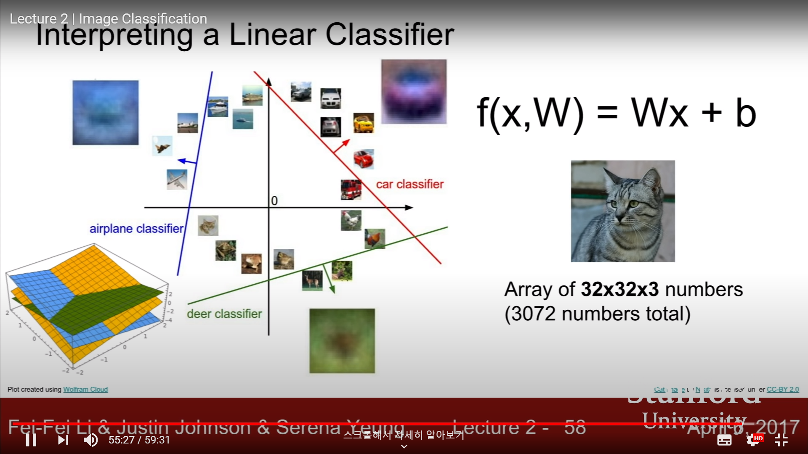

<sup> [CS231n Spring 2017 2강](https://www.youtube.com/watch?v=OoUX-nOEjG0&list=PLC1qU-LWwrF64f4QKQT-Vg5Wr4qEE1Zxk&index=2)을 듣고 정리한 내용입니다.  첨부된 모든 이미지는 해당 강의 영상을 바탕으로 합니다.</sup>


# Image Classification Pipeline


## 1. Outline


### Challenges


 The *task* of image classification is basically that a computer system aware of predetermined fixed category labels **looks into an image**, and then **assign** that image **one of those labels**. Seems easy for human, but it's not that simple for a machine to do so.

 A computer cannot get holistic idea of what an image represents for. What computer recognizes is a gigantic grid of numbers  between 0 and 255, where each pixel is represented by 3 numbers giving the red, green and blue values(3 channels of RGB). This is where the problem of **semantic gap** kicks in. What the label means is basically semantic, but pixel values are numeric. 

 Even more, our algorithms need to be robust for challenges listed below. 

|                     Viewpoint Variation                      |                         Illumination                         |                         Deformation                          |
| :----------------------------------------------------------: | :----------------------------------------------------------: | :----------------------------------------------------------: |
|  |  |  |
|                        **Occlusion**                         |                    **Backgroud Clutter**                     |                           **etc**                            |
|  |  |                <br>Intra-class Variation<br>…                |

<br>

 It is so challenging for a computer to classify an image of numerous objects while simultaneously handling all of these problems.

<br>

### Data-Driven Approach


 We can think of a simple API for an image classifier like below.


```python
def classify_image(image):
    # some magic here.
    return class_label
```


 Although there is no explicit way to ~~hard-~~code the above algorithm, there has been some attempts to do so. One of them is to make rules. Just find edges, corners from an image. Compute and categorize all corners, boundaries, and then make a set of rules to classify an image. 


 Though, this approach does not work well. Let alone the *brittleness*, it is *not* a *scalable* approach, which means that when trying to detect another object category, then we have to start all over again.

<br>

 Finally, the **data-driven approch** comes in. Rather than making rules all the time, **1)** Collect a large set of images, **2)** Train a ML/DL classifier, **3)** Evaluate it, and then **4)** Apply it to other images.


 With this approach, the API for an image classifier changes. Now, it is comprised of two functions.

* Train function: Inputs images and labels, and then outputs a model.
* Predict function: Inputs a model, and then outputs a prediction(*a.k.a* labels for test set). 

<br>

 Before diving into complex ML/DL algorithms sticking with data-driven approach, let's start with simple algorithms.

<br>

## 2. Nearest Neighbor Classifier


### Concept: Algorithm

<br>

 The algorithm here is pretty simple. 

```python
def train(images, labels):
    # Machine Learning
    return model

def predict(model, test_images):
    # Use model to predict labels
    return test_label
```

* training step: memorize all the training data.
* prediction step: take new image and find the most similar image.

<br>

 However, given a pair of images, how can we compare the distance between them? Here, we choose the simplest function, which is called **L1 distance**(sum of absolute value differences).


<br>

 Below is an example of Python code for Nearest Neighbors algorithm.

```python
class NearestNeighbor:
    def __init__(self):
        pass
    
    def train(self, X, y):
        '''X: N x D where each row is an example.
        Y: 1-d of size N'''
        # the classifier simply remembers all the training data.
        self.Xtr = X
        self.ytr = y
    
    def predict(self, X):
        '''X: N x D where each row is an example we wish to predict label for.'''
        num_test = X.shape[0]
        Ypred = np.zeros(num_test, dtype=self.ytr.dtype) # output type should match the input type.
        for i in xrange(num_test):
            # find the nearest training image to the i'th test image using L1 distance.
            distances = np.sum(np.abs(self.Xtr - X[i, :]), axis=1)
            min_index = np.argmin(distances)
            Ypred[i] - self.ytr[min_index]
        return Ypred
```

- train: memorize training data. O(1)  (=*just memorize the data at each step*).
- predict: for each test image, find closest train image and predict label of nearest image. O(N) (=*comparison step for each of n training samples*).

<br>

 So what the algorithm does is to draw boundaries between data points.


 Above is an example of decision regions of nearest neighbors. Nearest Neighbor Classifier carved up the space of data points. However, this classifier is not so good. Some problems come out. The regions are somewhat spurious.

* center almost green but one point yellow, even though it should be green.
* green region pushing into blue region.

<br>

 ### Generalization: KNN, Hyperparameters


 To generalize the nearest neighbor idea and deal with some problems, we use **mojority vote** from K closest points. Rather than just looking for the single nearest neighbor, instead find k nearest neighbors according to distance metric and then take a vote from each of neighbors.


<center><sup>As k goes larger, boundaries smooth out, leading to a better result.</sup></center>


<br>

 We can use different distance metric as well. 


> *Choice of Distance Metric*
>
> * L1 distance: depends on choice of coordinate systems. Used when individual input feature has important meaning.
> * L2 distance: change of coordinate frame doesn't matter.  


 Different distance metrics make different results, like below.


<br>

 So, when trying to use the nearest neighbors algorithm in practice, there are several choices to make, which are called **hyperparameters**.

* K: the number of nearest neighbors.
* distance metric: L1 vs. L2, etc.

<br>

### Choice of Hyperparameters


 How can we make those choices? Actually, there's not an explicit way. KNN hyperparameters are not necesarilly learned from training data. They are very problem-dependent. Just try different values for data and problem, and figure out which works out best. Several methods exist.


 First, choose hyperparameters that results in best accuracy(*=best performance*). **Never. This is terrible!** With this strategy, you'll always gonna pick k = 1. When k is 1, the classifier will always classifiy trainig data perfectly. However, what matters is *unseen* data. We don't care about fitting on training data. 

 Second, take full dataset and split it into train set and test set. Train with different hyperparameters and apply that classifier to test data. That way, we can choose which works best. Again, **Never. This is terrible!** It is possible to fit test set with this strategy, but it is not representative of new unseen data.

 Third, the most general idea. Split data into 3 different partitions: train set, validation set, test set. Train with many different hyperparmaeters and choose the best hyperparameters on validation set. Then, evaluate on test set. Remember, you should only run ONCE on the test set.

<br>


 Another strategy, yet quite commonly used, which is called cross-validation. Split the whole data set into many different folds and cycle through choosing validation set. Even though you can get higher confidence, this approach is not used in DL much, because it's highly computationally expensive.

<br>

> *Q) Test set not being representative of data out there?*
>
>  Actually, when collecting data, there's an underlying assumption that all data are **i.i.d**. That means, we suppose that all of the data points are drawn from the same underlying probability distribution.
>
>  However, this might not always be the case, and this can definitely be a problem *in practice*. One possible solution (*instructor himself*), for example, might be go and collect a whole bunch of data all at once using the exact same methodology, and then afterwards partition it randomly between train and test. 
>
>  This can still be a problem, though, when collecting data over time and making earlier data be training data, and the later data be testing data (=빅콘테스트 기간 동안 만들고자 했던 **시간에 강건한 시계열 모형**을 만들기 위해 데이터셋을 구성하는 방법을 떠올려 보자.) *Anyway*, **as long as** the partition is random among the entire set of data points, the problem can be **alleviated**. 


 When adopting CV approach, choosing the best hyperparmeters based on the graph below can be a good option.


* x-axis: value of k.
* accuracy of classifier on some dataset for diff values of k.

  In this case, 5-fold CV was done, and each of 5 different points on the same x-axis represent accuracy.

<br>

### Applying KNN in practice


 To wrap up, KNN classifier on images is almost never used in practice for those three reasons.


1. Very slow at test time

 As explained earlier, with N examples, training KNN classifier takes O(1), while prediction takes O(N). This is bad. We want our classifiers to be fast at prediction stage. Being slow at training stage is OK. In this point of view, KNN classifiers are somewhat *reversive* (or, not efficient).

<br>

2. Varying results upon distance metrics

 Applying distance metrics on pixels is not a really good way. As you can see below, the L2 distance between normal and distorted images are the same.


<br>

3. Curse of dimensionality


 Here's a good analogy for classifying; dropping paint over scattered data points in a space and draw a line to partition the space. It means that if we expect the knn classifier to work well, we need our training examples to cover the space quite **densely**. Otherwise, nearest neighbors could be quite *far away*, and *might not actually be very similar* to our **testing points**. 

The problem is that, in order to densely cover the space, we need a number of training examples, which is **exponential in the dimension** of the problem. Let alone the exponentiality, basically, we cannot get enough number of images to densely cover this space of pixels in this high dimensional space.


<br>

### Summary: KNN


<br>


## 3. Linear Classification


### Parametric Approach


 Let's take a different approach from KNN. KNN classifiers have no parameters. They just keep around the whole training data and use them at test time. However, we can think of another classifier that comprises of two different components.

* Takes in the input data(*= images, $$X$$*). 
* Summarizes the knowledge of input data, and stick with that information into a parameter(*= weights, $$W$$*). 


 In this point of view, what we have to do is to write down a function of $$X$$ and $$W$$, which spits out numbers each of which describes class scores. The larger the score, the larger the probability for the class. This is called **Parametric Models**, and the functional form of each model results in different architecture. The difference between KNN classifiers and parametric models is that, with parametric approach, once we have trained matrix $$W$$, we can *throw out* training data and get score for new sample. Much more efficient!


### Linear Classifier


 Actually, the whole story of deep learning is coming up with the right structure for the function *f*. One of the simplest functions of the kind is a funcional form of simple **matrix vector multiply**. 


 Unpack the dimension of each term!

* $$X$$: input image flattened.
* $$output$$ : single column vector of N elements, where N represents the number of classes.

<br>

 Here, we can add **bias** term. 

 

 The bias term is a constant vector, which does not interact with the data. This term indicates data-independent preferences for some classes and others. For example, if your dataset is unbalanced, say, has much more cat images than those of dogs, then the bias term for label *cat* will be higher. 


### Viewpoint: Template Matching


 What actually the linear classifier is doing? One point of view is **Template Matching**. 

<br>


 The classifier takes in 2 x 2 image, stretch it out into a single vector. The weight matrix of the classifier has a shape of (4, 3), each row representing each of the class labels. There is an additional bias vector, which is data-independent. The inner product(*=dot product*) of each row of weight matrix and pixels of the input image is the **score for each label**. 

 In this point of view, each of weight matrix corresponds to some template of the image, and the dot product of between the row and column of pixels corresponds to the similarity between template of class and pixels of the image. The linear classifier's job here is to match pixels of images into a template of label, using the weight matrix; and bias, of course.

<br>

 So, let's take the rows of weight matrix, and unravel them back to images. This way, we can visualize templates of a linear classifier to some form of images. It'll give us a sense of what the classifier is doing.


 Cool, but weird. Look at *horse*. A horse has two heads! This is because the linear classifier is only learning 1 template for each class every time. When variation comes in, the classifier tries to average all the variations and use just 1 single template to categorize images.


### Viewpoint: Drawing a Line


 Let's take another point of view. Think of images as points in high-dimensional space. 



 Then, the task of linear classifier can be interpreted as drawing linear decision boundary between scattered data points. That means, the linear classifier classifies images of one category against images of all other categories throughout the process of training. 

<br>

 With this viewpoint, problem comes out that there are hard cases for a linear classifier to do its job. That is, the classifier cannot draw decision boundaries between data points. 


* odd/even, XOR.
* parity
* multimodal situation (*analogy of islands of horses facing different way*)


### Summary


