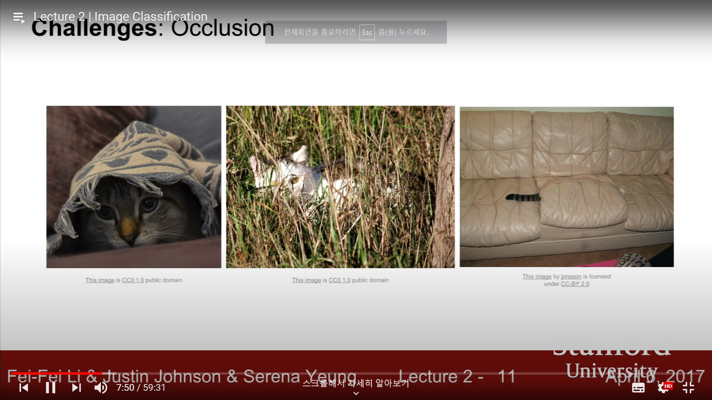

<sup> [CS231n Spring 2017 2강](https://www.youtube.com/watch?v=OoUX-nOEjG0&list=PLC1qU-LWwrF64f4QKQT-Vg5Wr4qEE1Zxk&index=2)을 듣고 정리한 내용입니다. 모든 이미지는 해당 강의 영상을 바탕으로 합니다.</sup>


# Image Classification Pipeline


## 1. Outline


### Challenges


 The task of image classification is basically that a computer system aware of predetermined fixed category labels looks into an image, and then assign that image one of those labels. Seems easy for human, but it's not that simple for a machine to do so.

 A computer cannot get holistic idea of what an image represents for. What computer recognizes is a gigantic grid of numbers  between 0 and 255, where each pixel is represented by 3 numbers giving the red, green and blue values(3 channels of RGB). This is where the problem of **semantic gap** kicks in. What the label means is basically semantic, but pixel values are numeric. 

 Even more, our algorithms need to be robust for challenges listed below. 

|                     Viewpoint Variation                      |                         Illumination                         |                         Deformation                          |
| :----------------------------------------------------------: | :----------------------------------------------------------: | :----------------------------------------------------------: |
|  |  |  |
|                        **Occlusion**                         |                    **Backgroud Clutter**                     |                           **etc**                            |
|  |  |                <br>Intra-class Variation<br>…                |

<br>

 It is so challenging for a computer to classify an image of numerous objects while simultaneously handling all of these problems.

<br>

### Data-Driven Approach


 We can think of a simple API for an image classifier like below.


```python
def classify_image(image):
    # some magic here.
    return class_label
```


 Although there is no explicit way to ~~hard-~~code the above algorithm, there has been some attempts to do so. One of them is to make rules. Just find edges, corners from an image. Compute and categorize all corners, boundaries, and then make a set of rules to classify an image. 


 Though, this approach does not work well. Let alone the *brittleness*, it is *not* a *scalable* approach, which means that when trying to detect another object category, then we have to start all over again.

<br>

 Finally, the **data-driven approch** comes in. Rather than making rules all the time, **1)** Collect a large set of images, **2)** Train a ML/DL classifier, **3)** Evaluate it, and then **4)** Apply it to other images.


 With this approach, the API for an image classifier changes. Now, it is comprised of two functions.

* Train function: Inputs images and labels, and then outputs a model.
* Predict function: Inputs a model, and then outputs a prediction(*a.k.a* labels for test set). 

<br>

 Before diving into complex ML/DL algorithms sticking with data-driven approach, let's start with simple algorithms.

<br>

## 2. Nearest Neighbor Classifier


### Concept: Algorithm

<br>

 The algorithm here is pretty simple. 

```python
def train(images, labels):
    # Machine Learning
    return model

def predict(model, test_images):
    # Use model to predict labels
    return test_label
```

* training step: memorize all the training data.
* prediction step: take new image and find the most similar image.

<br>

 However, given a pair of images, how can we compare the distance between them? Here, we choose the simplest function, which is called **L1 distance**(sum of absolute value differences).


<br>

 Below is an example of Python code for Nearest Neighbors algorithm.

```python
class NearestNeighbor:
    def __init__(self):
        pass
    
    def train(self, X, y):
        '''X: N x D where each row is an example.
        Y: 1-d of size N'''
        # the classifier simply remembers all the training data.
        self.Xtr = X
        self.ytr = y
    
    def predict(self, X):
        '''X: N x D where each row is an example we wish to predict label for.'''
        num_test = X.shape[0]
        Ypred = np.zeros(num_test, dtype=self.ytr.dtype) # output type should match the input type.
        for i in xrange(num_test):
            # find the nearest training image to the i'th test image using L1 distance.
            distances = np.sum(np.abs(self.Xtr - X[i, :]), axis=1)
            min_index = np.argmin(distances)
            Ypred[i] - self.ytr[min_index]
        return Ypred
```

- train: memorize training data. O(1)  (=*just memorize the data at each step*).
- predict: for each test image, find closest train image and predict label of nearest image. O(N) (=*comparison step for each of n training samples*).

<br>

 So what the algorithm does is to draw boundaries between data points.


 Above is an example of decision regions of nearest neighbors. Nearest Neighbor Classifier carved up the space of data points. However, this classifier is not so good. Some problems come out. The regions are somewhat spurious.

* center almost green but one point yellow, even though it should be green.
* green region pushing into blue region.

<br>

 ### Generalization: KNN, Hyperparameters


 To generalize the nearest neighbor idea and deal with some problems, we use **mojority vote** from K closest points. Rather than just looking for the single nearest neighbor, instead find k nearest neighbors according to distance metric and then take a vote from each of neighbors.


<center><sup>As k goes larger, boundaries smooth out, leading to a better result.</sup></center>


<br>

 We can use different distance metric as well. 


> *Choice of Distance Metric*
>
> * L1 distance: depends on choice of coordinate systems. Used when individual input feature has important meaning.
> * L2 distance: change of coordinate frame doesn't matter.  


 Different distance metrics make different results, like below.


<br>

 So, when trying to use the nearest neighbors algorithm in practice, there are several choices to make, which are called **hyperparameters**.

* K: the number of nearest neighbors.
* distance metric: L1 vs. L2, etc.

<br>

### Choice of Hyperparameters


 How can we make those choices? Actually, there's not an explicit way. KNN hyperparameters are not necesarilly learned from training data. They are very problem-dependent. Just try different values for data and problem, and figure out which works out best. Several methods exist.


 First, choose hyperparameters that results in best accuracy(*=best performance*). **Never. This is terrible!** With this strategy, you'll always gonna pick k = 1. When k is 1, the classifier will always classifiy trainig data perfectly. However, what matters is *unseen* data. We don't care about fitting on training data. 

 Second, take full dataset and split it into train set and test set. Train with different hyperparameters and apply that classifier to test data. That way, we can choose which works best. Again, **Never. This is terrible!** It is possible to fit test set with this strategy, but it is not representative of new unseen data.

 Third, the most general idea. Split data into 3 different partitions: train set, validation set, test set. Train with many different hyperparmaeters and choose the best hyperparameters on validation set. Then, evaluate on test set. Remember, you should only run ONCE on the test set.

<br>


 Another strategy, yet quite commonly used, which is called cross-validation. Split the whole data set into many different folds and cycle through choosing validation set. Even though you can get higher confidence, this approach is not used in DL much, because it's highly computationally expensive.


